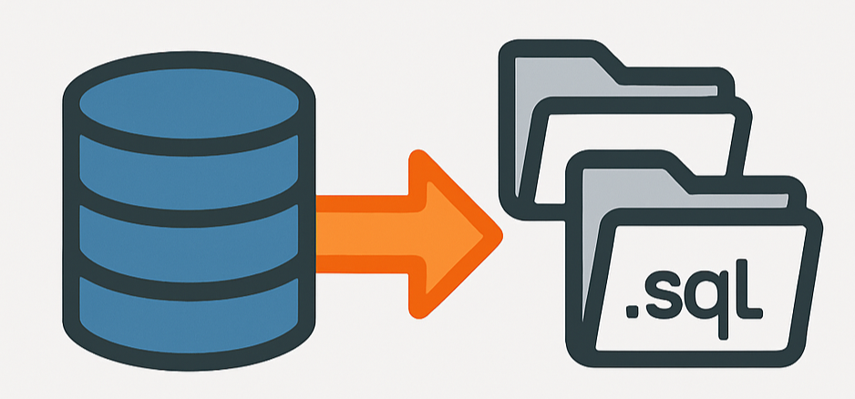

# Schema Colector

<p align="center">
  
</p>

Ferramenta para coletar objetos de um schema Oracle e organizá-los em arquivos SQL, de forma limpa e padronizada.

## Requisitos

- Python 3.7+
- Oracle Client
- Acesso ao banco de dados Oracle

## Instalação

1. Clone este repositório
2. Instale as dependências:
```bash
pip install -r requirements.txt
```

## Configuração

1. Crie um arquivo `.env` na raiz do projeto com as seguintes variáveis:
```
DB_USER=seu_usuario
DB_PASSWORD=sua_senha
DB_DSN=seu_host:porta/servico
DB_SCHEMA=seu_schema
```

## Uso via linha de comando

Execute o script principal:
```bash
python schema_colector.py
```

Os objetos serão coletados e organizados na pasta `schema_objects` com a seguinte estrutura (apenas os tipos de objetos realmente existentes serão criados):
```
schema_objects/
├── table/
├── view/
├── procedure/
├── function/
├── package/
├── trigger/
└── sequence/
```
Cada objeto será salvo em um arquivo `.sql` separado, com o nome do objeto em minúsculo.

### Observações importantes sobre a exportação
- Todo o conteúdo dos arquivos é salvo em **letras minúsculas**.
- O termo `editionable` é removido dos scripts.
- O `OWNER` e as aspas duplas são removidos dos nomes dos objetos e de todas as referências.
- Cláusulas do tipo `OWNER TO ...` também são removidas.
- As pastas de cada tipo só são criadas se houver pelo menos um objeto daquele tipo.

## Interface Gráfica

Você pode executar a interface gráfica (GUI) para facilitar a configuração e exportação:
```bash
python schema_colector_gui.py
```

A interface exibe uma barra de progresso mostrando:
- O percentual concluído
- A quantidade de arquivos processados e o total (ex: 13/16)
- O nome do arquivo atual sendo processado

Exemplo:
```
Progresso
[███████████---------] 81.2%  13/16  clientes.sql
```

## Funcionalidades

- Coleta de tabelas
- Coleta de views
- Coleta de procedures
- Coleta de functions
- Coleta de packages
- Coleta de triggers
- Coleta de sequences

## Logs

O script gera logs detalhados sobre o processo de coleta, incluindo:
- Conexão com o banco de dados
- Coleta de cada objeto
- Erros que possam ocorrer durante o processo

## Estrutura do Projeto

```
schema-colector/
├── schema_colector.py         # Script principal (CLI e lógica)
├── schema_colector_gui.py     # Interface gráfica (GUI)
├── requirements.txt            # Dependências
├── README.md                   # Este arquivo
├── tests/                      # Testes automatizados
└── schema_objects/             # Pasta onde os objetos são salvos
```

## Contribuição

1. Faça um fork do projeto
2. Crie uma branch para sua feature (`git checkout -b feature/nova-feature`)
3. Commit suas mudanças (`git commit -m 'Adiciona nova feature'`)
4. Push para a branch (`git push origin feature/nova-feature`)
5. Abra um Pull Request

## Licença

Este projeto está sob a licença MIT. Veja o arquivo [LICENSE](LICENSE) para mais detalhes. 